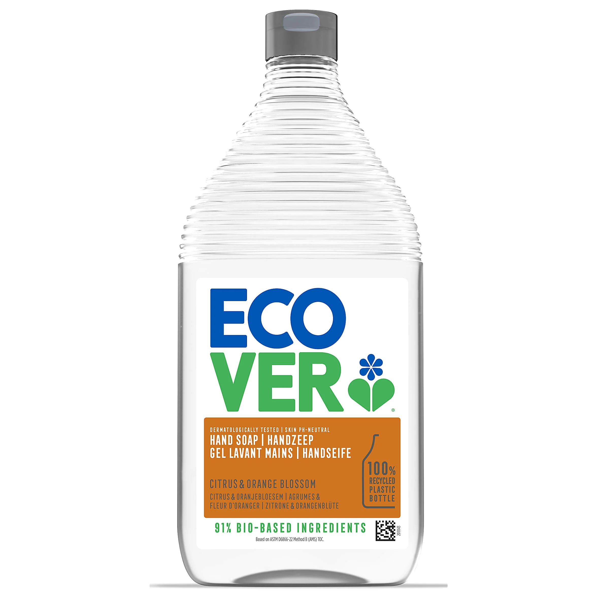
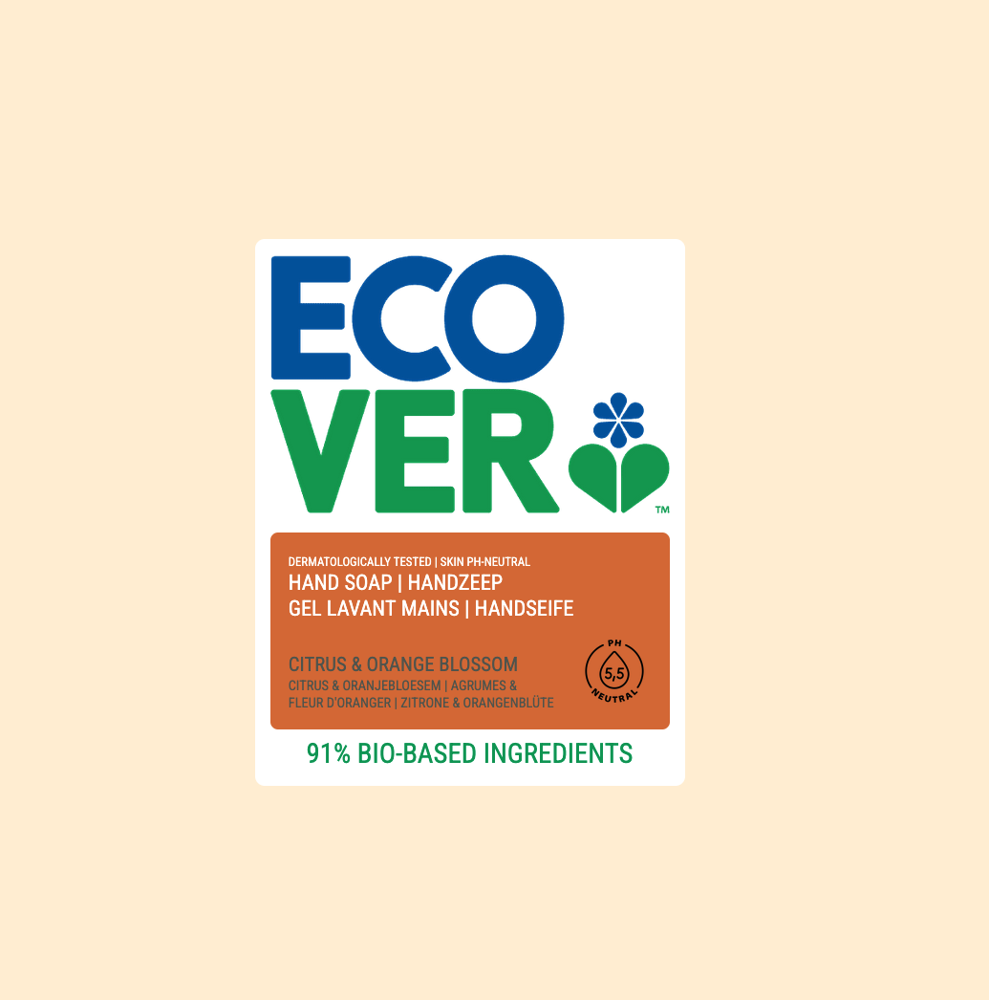
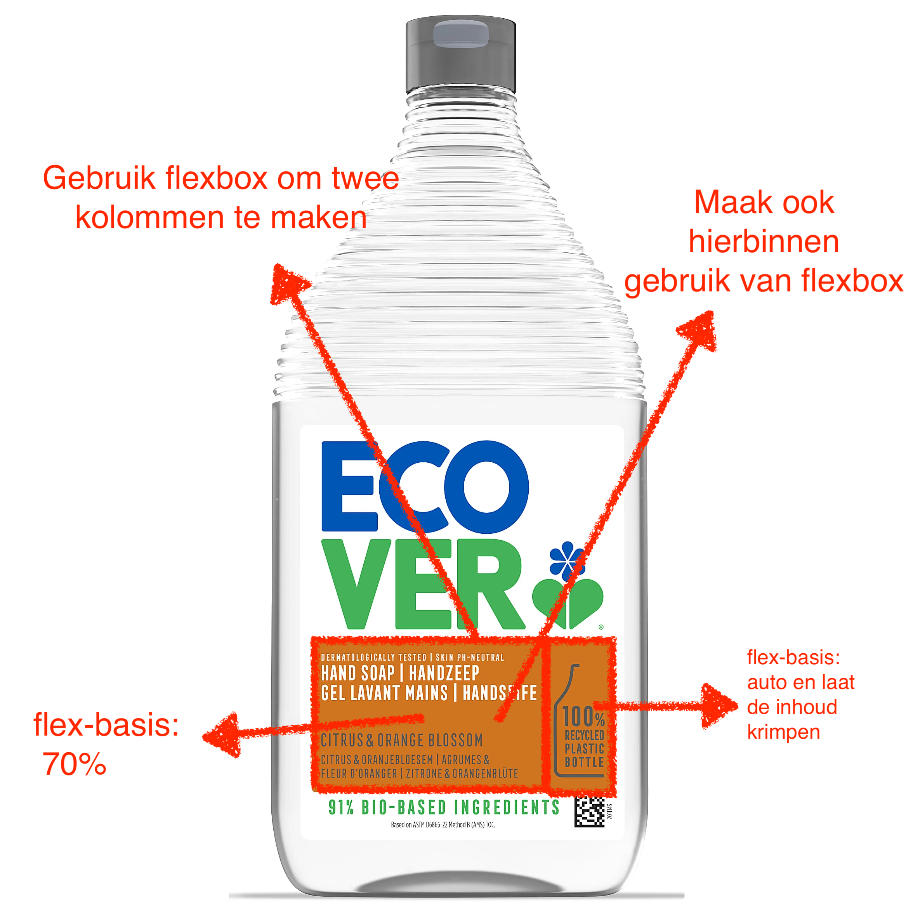

# Ecover

In deze oefening gaan we een label van een fles Ecover handzeep nabouwen.





Kleuren:
```
Achtergrond kleur: papayawhip;
Primaire kleur: #009F58;
Secondaire kleur: #005CB0;
Product kleur: #D97233;
```

* Fonts: Gezien Ecover betalende fonts gebruikt voor hun product teksten gaan we gebruik maken van Google Fonts. We gebruiken een _condensed_ font dat lijkt op het font dat Ecover gebruikt, namelijk [**Roboto Condensed**](https://fonts.google.com/specimen/Roboto+Condensed).
* Zorg er voor dat het label mooi in de midden van je pagina staat. Gebruik hiervoor flexbox. 
    > Tip: maak de body minimaal 100vh hoog.
* Bouw het volgende ontwerp zo nauwkeurig mogelijk na
* Implementeer de volgende flex-settings


