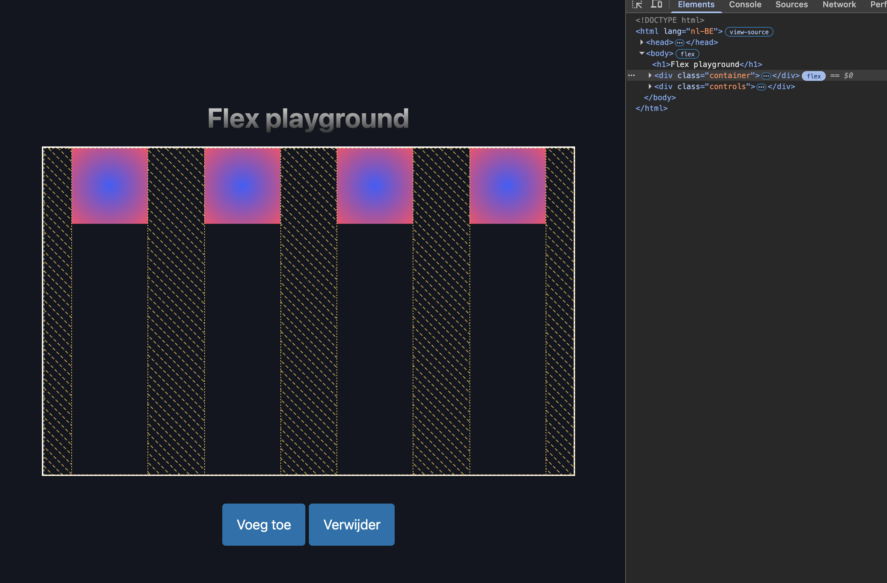

# Playground

Deze map bevat een playground waarin je gemakkelijk mee kunt experimenteren met flexbox. Er zijn twee knopjes waarmee je flex children kunt toevoegen of verwijderen. Deze knoppen worden aangestuurd door JavaScript. Het gebruik van JavaScript komt in het volgende semester aan bod, maar je mag gerust al eens een kijkje nemen in het `script.js` bestand om te zien hoe dit werkt.

Bekijk nu de `style.css` file, je zult zien dat `.container` de flex-parent is en dat de `.box` elementen de flex-children zijn. De container heeft al enkele flexbox eigenschappen toegewezen gekregen, maar er zijn nog veel meer eigenschappen die je kunt gebruiken.

Enkele experimentjes die je kunt doen:
* Probeer verschillende `flex-direction` waarden uit.
* Probeer verschillende `justify-content` waarden uit.
* Probeer verschillende `align-items` waarden uit.
* Probeer verschillende `flex-wrap` waarden uit.
* Probeer verschillende `align-content` waarden uit (hiervoor moet je wel eerst genoeg flex children toevoegen zodat ze gaan wrappen).
* Probeer verschillende `align-self` waarden uit op de individuele flex children (gebruik hiervoor de `:nth-child()` selector in CSS, want de `.box` elementen worden dynamisch toegevoegd in JavaScript dus je kunt er niet eenvoudigweg een class aan meegeven).
* Probeer verschillende `order` waarden uit op de individuele flex children (ook hiervoor kun je de `:nth-child()` selector gebruiken).
* Probeer verschillende `flex-grow`, `flex-shrink` en `flex-basis` waarden uit op de individuele flex children (ook hiervoor kun je de `:nth-child()` selector gebruiken).
* Probeer verschillende `gap` waarden uit op de container.
* Probeer verschillende `row-gap` en `column-gap` waarden uit op de container.
* Probeer verschillende `flex` shorthand waarden uit op de individuele flex children (ook hiervoor kun je de `:nth-child()` selector gebruiken).

> Tip: gebruik de DevTools van je browser om te zien hoe de verschillende flexbox eigenschappen invloed hebben op de layout.

